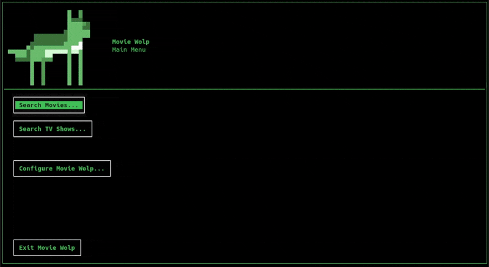

# 🎬 Movie Wolp 🐺

Movie Wolp is a **terminal-based media library explorer** built with Python using [Textual](https://textual.textualize.io/) and [Rich Pixels](https://pypi.org/project/rich-pixels/).



---

## 🦴 Requirements

Before running Movie Wolp, make sure you have the following installed:

- Python 3.10+
- Dolphin (KDE's file manager)

&nbsp;

---

## Installation 🦮🧰

1. **Clone the repo & open the project directory in your terminal**:
   ```bash
   git clone https://github.com/WolfPup1232/movie-wolp.git
   cd movie-wolp
   ```

2. **Create a Python virtual environment**:
   ```bash
   python3 -m venv venv
   source venv/bin/activate
   ```

3. **Install Python dependencies**:
   ```bash
   pip install -r requirements.txt
   ```

   &nbsp;

---

## 🐾 Running Movie Wolp 🐾

From the project directory:

```bash
python movie-wolp.py
```

On first launch, you’ll be prompted to configure your movie and TV show library folders.

&nbsp;

---

### (Optional) .desktop Shortcut

Make a handy little desktop shortcut to run Movie Wolp:

```
[Desktop Entry]
Type=Application
Terminal=false
Name=Movie Wolp
Exec=konsole --noclose -e bash -c "source /path/to/movie-wolp/venv/bin/activate && python /path/to/movie-wolp/movie-wolp.py; exec bash"
Icon=/path/to/movie-wolp/wolp-64.png
```

&nbsp;

---

## Uninstall 🧹💨


To uninstall Movie Wolp, just delete the folder!💥

&nbsp;

---

## 📜 License

MIT License  
Copyright © 2025 WolfPup1232  
Icons by Icons8

---
